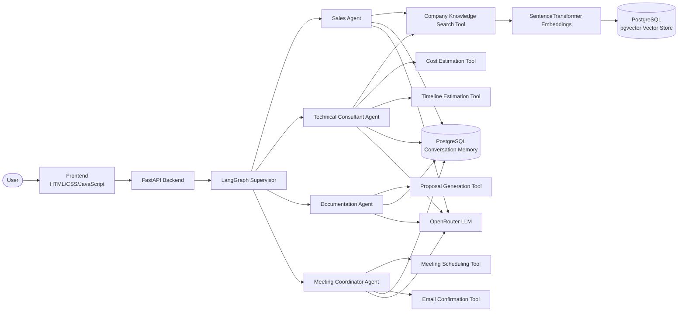

# DigitalSofts Agentic Customer Success System

An AI-powered multi-agent customer success system built for the DigitalSofts AI Engineering Internship assignment. The system answers company-related questions using Retrieval-Augmented Generation (RAG), routes requests through specialized AI agents, books meetings, generates proposal summaries, estimates project cost and timeline, and maintains conversation memory.


Repository: <YOUR_GITHUB_REPO_LINK>

---

## Table of Contents

1. [Project Overview](#project-overview)
2. [Features](#features)
3. [System Architecture](#system-architecture)
4. [Architecture Diagram](#architecture-diagram)
5. [Tech Stack](#tech-stack)
6. [Project Structure](#project-structure)
7. [Installation](#installation)
8. [Environment Variables](#environment-variables)
9. [Running Locally](#running-locally)
10. [Docker Usage](#docker-usage)
11. [API Documentation](#api-documentation)
12. [Agent Workflow](#agent-workflow)
13. [RAG Pipeline](#rag-pipeline)
14. [Conversation Memory](#conversation-memory)
15. [Tool Calling](#tool-calling)
16. [Testing](#testing)
17. [Logging and Error Handling](#logging-and-error-handling)
18. [Future Improvements](#future-improvements)
19. [License](#license)

---

## Project Overview

DigitalSofts required an AI-driven customer success assistant capable of handling sales, technical, documentation, and scheduling conversations autonomously. This project implements that assistant as a supervisor-orchestrated multi-agent system:

- A **LangGraph Supervisor** classifies each incoming message and routes it to the correct specialist agent.
- Four **specialized agents** — Sales, Technical Consultant, Documentation, and Meeting Coordinator — handle domain-specific conversations, each with its own set of tools.
- A **RAG pipeline** grounds company-related answers using PostgreSQL with the pgvector extension.
- **Conversation memory** persists client profile data and session state in PostgreSQL, shared across all agents.
- The system is exposed through a **FastAPI** REST API with a lightweight HTML/CSS/JavaScript chat frontend.

---

## Features

| Feature | Description |
|---|---|
| Multi-Agent Routing | Supervisor-based routing to Sales, Technical, Documentation, and Meeting agents |
| Retrieval-Augmented Generation (RAG) | Semantic search over a PostgreSQL knowledge base using pgvector |
| Conversation Memory | Client profile and session history persisted in PostgreSQL |
| Tool Calling | Agents invoke domain-specific tools to complete tasks |
| Project Proposal Generation | Automated proposal summary generation |
| Meeting Booking | Meeting scheduling with email confirmation |
| Cost Estimation | Project cost estimation based on scope |
| Timeline Estimation | Project delivery timeline estimation |
| Logging | Structured application logging |
| Error Handling | Graceful handling of agent and API failures |
| Docker Support | Containerized deployment |
| Unit Tests | Automated test coverage for core components |
| FastAPI REST API | Documented HTTP endpoints for chat and session management |
| Basic HTML/CSS/JavaScript Frontend | Browser-based chat interface |

---

## System Architecture

The system follows a supervisor-based multi-agent design:

- **Frontend (HTML/CSS/JavaScript)** — sends user messages to the backend and renders agent responses.
- **FastAPI Backend** — exposes the REST API and coordinates request handling.
- **LangGraph Supervisor** — classifies each message and routes it to exactly one specialist agent:
  - **Sales Agent** — service and pricing inquiries, using Company Knowledge Search
  - **Technical Consultant Agent** — technical questions, using Company Knowledge Search, Cost Estimation, and Timeline Estimation
  - **Documentation Agent** — proposal generation, using Proposal Generation
  - **Meeting Coordinator Agent** — meeting scheduling, using Meeting Scheduling and Email Confirmation

All agents share two common dependencies:

- **PostgreSQL Conversation Memory** — for reading and updating client profile and session state.
- **OpenRouter LLM** — for generating natural-language responses.

---

## Architecture Diagram

<!-- Mermaid architecture diagram placeholder -->


---

## Tech Stack

| Layer | Technology |
|---|---|
| Language | Python |
| API Framework | FastAPI |
| Agent Orchestration | LangGraph |
| LLM Provider | OpenRouter |
| Embeddings | SentenceTransformers |
| Vector Store | PostgreSQL + pgvector |
| Knowledge Base | PostgreSQL |
| Conversation Memory | PostgreSQL |
| Database | PostgreSQL |
| Frontend | HTML, CSS, JavaScript |
| Containerization | Docker |

---

## Project Structure

```
app/
├── agents/       # Supervisor and specialized agent implementations
├── memory/       # Conversation memory and session persistence
├── rag/          # Knowledge base and pgvector integration
├── tools/        # Agent tools (knowledge search, cost, timeline, proposal, meeting, email)
├── frontend/     # Chat interface (HTML/CSS/JS)
└── tests/        # Unit tests
├── docs/
│   ├── chat-ui.png
│   ├── swagger.png
│   └── architecture.png
```

---

## Installation

### Prerequisites

- Python 3.11+
- PostgreSQL instance with the `pgvector` extension enabled
- An OpenRouter API key
- Docker (optional, for containerized deployment)

### Setup

```bash
git clone <YOUR_GITHUB_REPO_LINK>
cd digitalsofts-agentic-customer-success
python -m venv venv
source venv/bin/activate   # Windows: venv\Scripts\activate
pip install -r requirements.txt
```

---

## Environment Variables

| Variable | Description |
|---|---|
| `OPENROUTER_API_KEY` | API key for the OpenRouter LLM provider |
| `OPENROUTER_BASE_URL` | Base URL for the OpenRouter API |
| `MODEL_NAME` | Chat model identifier used by the agents |
| `EMBEDDING_MODEL` | SentenceTransformers model used for embeddings |
| `DATABASE_URL` | PostgreSQL connection string (knowledge base, memory, pgvector) |
| `LOG_LEVEL` | Application logging level |

Copy `.env.example` to `.env` and populate the values above before running the application.

---

## Running Locally

```bash
uvicorn main:app --host 0.0.0.0 --port 8000
```

- API documentation: `http://localhost:8000/docs`
- Chat frontend: `http://localhost:8000/`

---

## Docker Usage

**Build the image:**

```bash
docker build -t digitalsofts-agent .
```

**Run the container:**

```bash
docker run -p 8000:8000 --env-file .env digitalsofts-agent
```

The container requires a reachable PostgreSQL instance (with `pgvector` enabled) via `DATABASE_URL`.

---

## API Documentation

| Method | Endpoint | Description |
|---|---|---|
| `POST` | `/chat` | Send a message and receive a routed agent response |
| `POST` | `/reset-session` | Reset a session's conversation memory |
| `GET` | `/health` | Health check endpoint |
| `GET` | `/metrics` | Basic usage metrics |

### POST /chat

**Request**

```json
{
  "session_id": "b3f1c2e4-1a2b-4c3d-9e8f-123456789abc",
  "message": "What would an AI chatbot project cost?"
}
```

**Response**

```json
{
  "reply": "For an AI chatbot project, pricing typically depends on complexity and integration requirements...",
  "agent": "sales",
  "confidence": 0.9,
  "client_profile": {
    "client_name": null,
    "company": null,
    "project_type": "ai solution"
  }
}
```

### POST /reset-session

**Request**

```json
{ "session_id": "b3f1c2e4-1a2b-4c3d-9e8f-123456789abc" }
```

**Response**

```json
{ "status": "reset", "session_id": "b3f1c2e4-1a2b-4c3d-9e8f-123456789abc" }
```

### GET /health

```json
{ "status": "ok" }
```

### GET /metrics

```json
{
  "total_requests": 0,
  "total_retries": 0,
  "agent_usage": {},
  "active_sessions": 0
}
```

---

## Agent Workflow

1. The user sends a message to `/chat`.
2. The **LangGraph Supervisor** analyzes the message and determines the appropriate agent.
3. The selected agent (Sales, Technical, Documentation, or Meeting) processes the request, invoking its tools as needed.
4. The agent generates a response via the OpenRouter LLM, informed by tool output and conversation memory.
5. The response, routing decision, and updated client profile are returned to the client.

---

## RAG Pipeline

1. Company knowledge (services, pricing, FAQs) is stored in a **PostgreSQL knowledge base**.
2. Records are embedded using **SentenceTransformers**.
3. Embeddings are indexed in **PostgreSQL using the pgvector extension**.
4. Incoming queries are embedded and matched against the vector store via similarity search.
5. The most relevant records are retrieved and passed to the requesting agent (Sales or Technical Consultant) to ground its response.

---

## Conversation Memory

- Client profile and conversation history are persisted per session in **PostgreSQL**.
- Each session maintains a client profile (e.g., name, company, project type, budget, timeline) that is reused across the conversation so agents do not need to re-request known information.
- Conversation memory is shared across all four agents, allowing context to carry over when a conversation is routed between agents.
- Sessions can be cleared via the `/reset-session` endpoint.

---

## Tool Calling

Each agent has access to a specific set of tools:

| Tool | Used By | Purpose |
|---|---|---|
| Company Knowledge Search | Sales, Technical Consultant | Retrieves relevant information from the RAG-backed knowledge base |
| Cost Estimation | Technical Consultant | Estimates project cost |
| Timeline Estimation | Technical Consultant | Estimates project delivery timeline |
| Proposal Generation | Documentation | Generates a structured project proposal summary |
| Meeting Scheduling | Meeting Coordinator | Creates a meeting booking |
| Email Confirmation | Meeting Coordinator | Sends a confirmation email upon successful booking |

Agents invoke tools as part of their reasoning process, and tool outputs are used to ground the final response returned to the user.

---

## Testing

Unit tests cover the API, conversation memory, and tools.

```bash
pytest
```

---

## Logging and Error Handling

- The application uses structured logging to record request handling, agent routing decisions, and tool execution.
- API errors are handled gracefully, returning appropriate HTTP status codes and error messages rather than unhandled exceptions.
- Agent-level failures are isolated so that a failure in one agent does not affect the availability of the overall API.

---

## Future Improvements

- Expand automated test coverage across all agents and tools.
- Add authentication and rate limiting to the API.
- Introduce streaming responses for chat interactions.
- Extend conversation analytics and reporting.

---

## License

MIT
